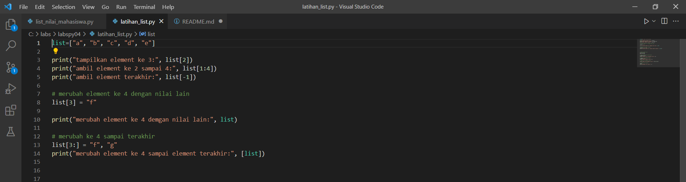
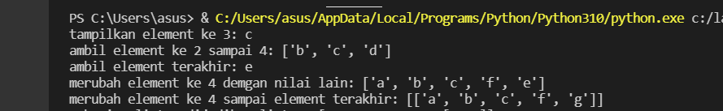
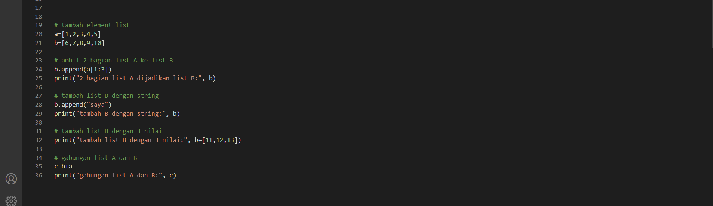
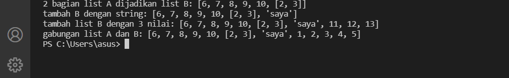
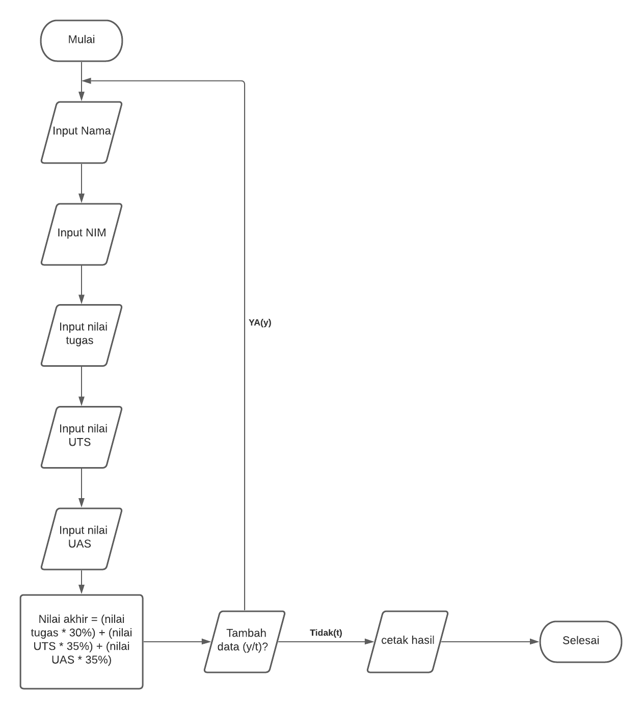
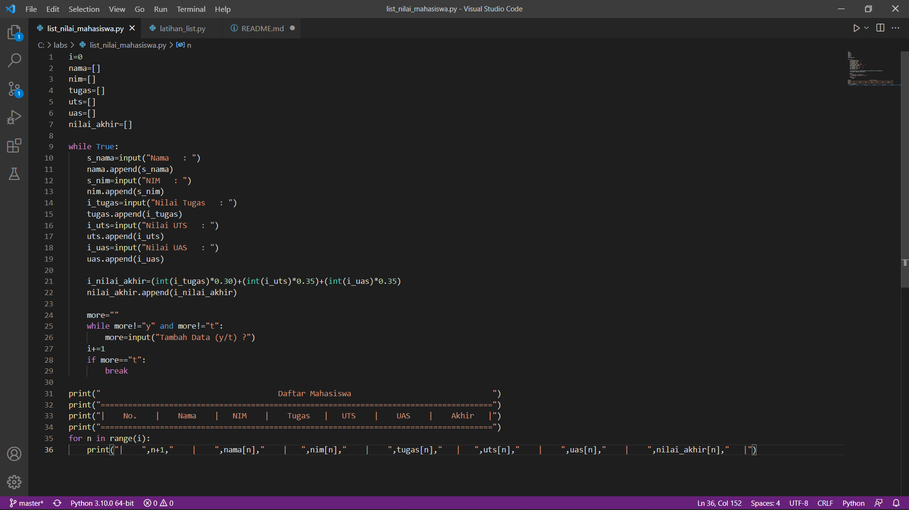
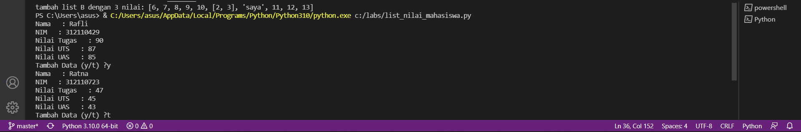
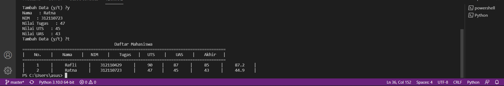

# labspy_04
## Latihan 1
##### latihan membuat list dengan menulis:
```python
list=[]
```
##### berikut script dalam python:


##### dengan keterangan
```python
list=["a", "b", "c", "d", "e"]
```
##### diatas adalah isi listnya
```python
print("Tampilkan elemen ke3: ",list[2])
```
##### diatas adalah perintah untuk menampilkan elemen ke 3 dalam list, karena elemen ke 3 ada di index 2, maka didalam list pakai kurung siku[2]
```python
print("ambil Element ke 2 sampai 4:", list[1:4]) 
```
##### diatas untuk perintah mengambil element ke 2 sampai ke 4 dengan index elemen ada di index 1 sampai 4
```python
print("ambil elemen terakhir:", list[5-1])
```
##### sedangkan diatas ini adalah perintah untuk mengambil element terakhir, karena di dalam list ada 5 element, maka digunakan -1 untuk mengambil element terakhir

### merubah element ke 4 dengan nilai lain
```python
list[3] = "f" 
```
##### sedangkan ini untuk merubah element ke 4 dengan nilai F, karena element ke 4 ada di index 3, maka ditulis list[3]
```python
print("merubah elemen ke 4 dengan nilai lain:", list)
```
##### merubah element ke 4 sampai terakhir
```python
list[3:] = "f", "g" 
```
##### ini untuk merubah elemen ke 4 sampai terakhir dengan str "f" dan "g". maka ditulis list[3:]
```python
print("merubah elemen ke 4 sampai elemen terakhir:", list)
```
##### berikut hasil dari pemogramannya



### Latihan untuk menambahkan elemen dalam list:
##### berikut bentuk programnya:

### menambahkan element list
```python
a=[1,2,3,4,5]
b=[6,7,8,9,10]
```
##### diatas adalah 2 listnya
### Ambil 2 bagian list A ke list B
```python
b.append(a[1:3])
print("2 bagian List A dijadikan List B:", b)
```
##### diatas adalah code untuk menambahkan list A kedalam list B dengan menggunakan perintah append
### tambah list B dengan 3 nilai
```python
print("Tambah list b dengan 3 nilai:", b+[11,12,13])
```
##### diatas adalah untuk menambahkan list B dengan 3 nilai dengan menggunakan arithmatic +
### menggabungkan list A dan B
```python
c=b+a
print("Gabungan list B dan A:", c)
```
##### berikut hasil dari programnya:

#### program latihan 1 selesai

## Membuat list nilai mahasiswa
##### berikut bentuk flowchart nya

##### dan berikut gambar programnya:

##### keterangan:
```python
i=0
```
##### diatas adalah untuk menginisiasikan variable i sama dengan 0, karena diprogram ini akan menggunakan perulangan while dan for, jadi perlu menginisiasikan agar tidak terjadi eror
```python
nama=[]
nim=[]
tugas=[]
uts=[]
uas=[]
nilai_akhir=[]
```
##### diatas adalah untuk mendefinisikan list nya, terdapat list untuk menampung nama, nim, tugas, uts, uas, dan nilai akhir
```python
while True:
    s_nama=input("Nama  : ")
    nama.append(s_nama)
    s_nim=input("NIM    : ")
    nim.append(s_nim)
    i_tugas=input("Nilai Tugas  : ")
    tugas.append(i_tugas)
    i_uts=input("Nilai UTS  : ")
    uts.append(i_uts)
    i_uas=input("Nilai UAS    : ")
    uas.append(i_uas)
```
##### diatas adalah code untuk menginput isi dalam list tersebut, juga untuk menambahkan list jika sudah menginput 1 nama atau nilai dalam list, dengan menggunakan append dan menggunakan pengulangan while
```python
i_nilai_akhir=(int(i_tugas)*0.30)+(int(i_uts)*0.35)+(int(i_uas)*0.35)
nilai_akhir.append(i_nilai_akhir)
```
##### diatas adalah code untuk menghitung nilai akhir dengan kondisi nilai akhir 30% dari nilai tugas, ditambah 35% dari nilai UTS dan juga 35% dari nilai UAS, dengan kemudian diubah persentase menjadi bentuk desimal, maka terdapat 0.30, 0.35. sedangkan untuk nilai_akhir.append adalah untuk menambahkan list dari yang telah di inputkan sebelum akhirnya di tampilkan
```python
more=""
    while more!="y" and more!="t":
        more=input("Tambah Data(y/t) ?")
    i+=1
    if more=="t":
        break
```
##### Program diatas adalah untuk perintah menambahkan data dengan pertanyaan ya atau tidak, dengan definisi jika ya, maka ketikkan y pada keyboard, maka akan mengulang inputan list. dan jika tidak, ketikkan t paada keyboard, maka akan menampilkan hasil list yang telah di inputkan
``` python
print("._____________________________________________________________________________________________________________.")
print("|                                             Daftar Mahasiswa                                                |")
print("|_____________________________________________________________________________________________________________|")
print("|  No.  |      Nama      |      NIM        |     Tugas      |      UTS      |      UAS      |      Akhir      |")
print("|-------------------------------------------------------------------------------------------------------------|")
```
##### diatas adalah contoh bentuk tabelnya
```python
for n in range(i):
    print("|    ",n+1,"    |    ",nama[n],"    |   ",nim[n],"    |    ",tugas[n],"   |   ",uts[n],"    |    ",uas[n],"    |    ",nilai_akhir[n],"   |")
```
##### sedangkan yang diatas adalah untuk menampilkan hasil dari list yang telah di inputkan, dengan menggunakan perulangan for n in range. dan berikut hasil dari code programnya:

